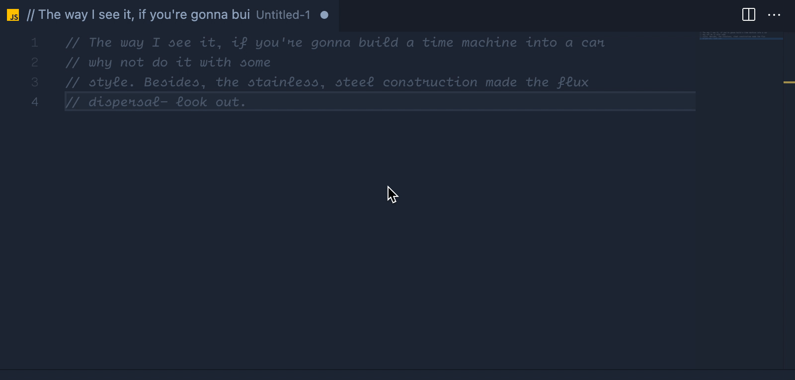

<center>

## Comment Wrap


Easily re-wrap comments to a given line width.

</center>



Turns this:

```js
// this is
// my comment that
// does not wrap properly
```

Into this:

```js
// this is my comment that does not wrap
// properly
```

Supports:

- ✅ Standard (JavaScript/TypeScript/Java etc.) style comments ( `//` )
- ✅ Block comments ( `/* */` )
- ✅ Dart-doc comments ( `///` )
- ❌ Anything else (Python, bash etc.) **yet**

### **Disclaimer**

This extension is in the very early stages of development (mostly a proof-of-concept at this stage, put together in about 15 minutes) so may not be fully functional.

**Checkout our other extension**

- [JSON Parse & Stringify](https://marketplace.visualstudio.com/items?itemName=nextfaze.json-parse-stringify)
